# Fied Profitability Index Predictive Model
#### *By using Python and Various Machine Learning Toolbox Such as XGboost*

## Background
-----------
In this work, we are aiming to solve a problem in oil and gas industry mainly in the government domain/ regulator poin of view. The complexity in oil and gas business spread accross almost of its domain, one example is in development aspect when engineers have to deliver investment grade plan under high scale of investment and high uncertainty. By using subsurface-economic data from various field in Indonesia, we are able to demonstrate how wide range of data that government collected can be utilize to assisst decision maker, engineers, new venture company, etc to verify its plan before decision is made.

## Objective
------------
In this work, we used a dataset from Indonesia Oil and Gas Government Institution, consisting of subsurface features such as field name, OGIP/ OOIP, and other subsurface parameters including economic indicator for each field.

Our main goal is to provide a benchmarking tool for Oil and Gas participants to get an ealy indicative economic value such as Profitability Index (PI) of newly discovered oil and gas fields. This information is crucial to enhance the field development concept from technical and economic point of view because engineer/ development staff/ entity could focus more on the fields that have higher chance to become profitable so they are able to increase their productivity and accelerate development stage.

## Process Overview
----------------
In this work, we try to define wheter an oil and gas field is profitable to be further developed or not together with its probability. we also used several models such as Decision Tree, XGBoost, LGBM, and Deep Learning. The flow chart below ilustrates the process we are doing in this project.

*Training set is Training Data + Validation Data

## Dataset & Features
----------------
In this work, we used the eSDC datasets, consisting of 20 original features and 1 target. eSDC is subsurface dataset proprietary by SKK Migas. We used 60-40 proportion for train and validation + test data and 50-50 proportion for valid & test data.

Features Name   |   Explanation |   Unit    |
---|---|---
temp    |   Field average temperature   |   F
depth   |   Field reservoir depth       |   feet
region  |   Region in Indonesia, such as Sumatera, Jawa, etc    |   -
field_name  | Name of the field | -
fluid   |   Fluid type, separate as Gas, Oil, and Gas-Oil   |   -
visc    | Viscosity of the fluid    |   cp
NPV     | Net Present Value         | Million USD
location    | Location of a field in the region, such as Jawa Timur | -
avg_fluid_rate  | Field production daily rate   | BOPD.e
total_cost  | Total development cost    | Million USD
opr_cost    | Total operational cost    | Million USD
cap_cost    | Total capital cost        | Million USD
saturate    | Oil/ Gas saturation in reservoir  | fraction
api_dens    | Fluid density. For Oil/ Oil-Gas as API and Gas as Sg  | -
perm    | Permeability  | md
poro    | Porosity  | fraction
inplace | Hydrocarbon initial in place  | MMBO.e
project_level   | Explaining project status on production stage | -
project_status  | Project location: Onshore, Offshore, BOTH | -
PI  | Profitability index   | NPV/Total Cost
prospect_rank   | 0 as marginal & 1 as profitabel   | target variable

## Exploratory Data Analysis
----------------------------
__Effect of inplace, avg_fluid_rate, fluid on prospect_rank__

We suspect there is a causal effect of `inplace` & `avg_fluid_rate` in `prospect_rank`. While we segmented on `fluid` we notice that by having bigger `inplace` and `avg_fluid_rate` could lead us to more preferable economic of scale benefit therefore significantly improve our field `prospect_rank` but we notice a high level anomaly on `fluid`==`Gas` where `avg_fluid_rate` are not giving significant impact any more on `prospect_rank`. This issue could be inferred from graph when `prospect_rank` == 0 exists together along `prospect_rank` 1. This issue need to be addressed in more detail analysis during modeling whether additional features are needed to clarify or not.

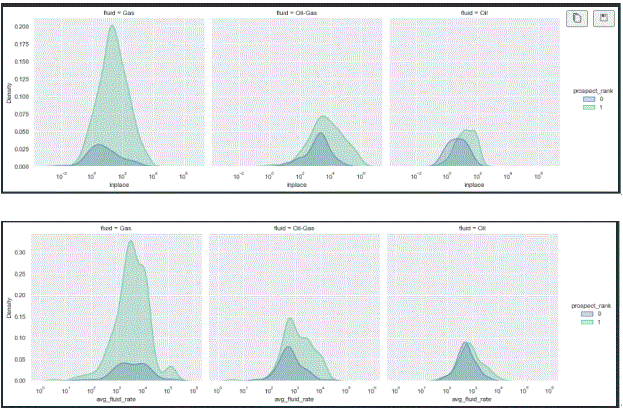

__Effect of depth, inplace, rate, fluid on prospect_rank__

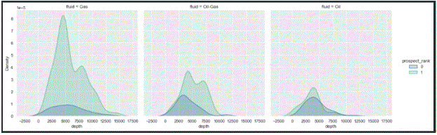

On above plot, we see minor insight regarding `depth` and its effect on `prospect_rank` while data is segmented by `fluid`. We can infer from high level that neither `fluid` nor `depth` will give significant influences on field prospect, instead most of the field will have better chance to be more economical when `depth` is shallower. Probably, we have to classify the data further by looking to other basic features to get better `prospect_rank` classification.

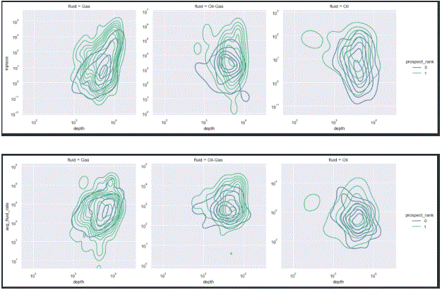

More insightful analysis is obtain when we classify `depth` further by using `inplace` and `avg_fluid_rate`. From 2 last plot above we spot meaningful informations that `inplace` and `avg_fluid_rate` play significant role in determining field `prospect_rank`. When fields are having a deeper reservoir target they need either bigger `inplace` or `avg_fluid_rate` in order to become more economical.

We agree that some anomalies exists, for example on `Gas` where `prospect_rank` are not clasify properly. We believe, although more analysis in ML are needed, that this issue occurs only on `Gas` because sometimes gas production is limited by market potential and could limit their withdrawal rate. This problem could erode economical value in accordance. So, we suspect on `Gas` that either `region` or `location` could play major role to spot non market potential area/ region.

__Effect of inplace, rate, region, fluid==Gas on prospect_rank__

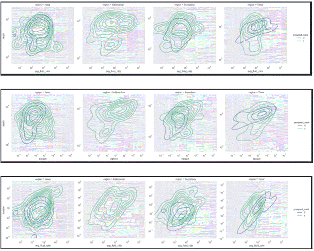

As we spot earlier on previous analysis that `region` plays a crucial role making `prospect_rank` clasification using `depth`, `inplace`, and `avg_fluid_rate` when `fluid`==Gas. On above plots, we are convinced that 1 region (timur) is probably the reason causing this issue. When all others region shows consistent trend reflecting good and rational relationship between `depth`, `inplace`, `avg_fluid_rate` on `prospect_rank`, but `region`==Timur shows the opposite. This information/ our hypothesis from data relates to actual condition where market potential for gas on eastern indonesia (timur) is very limited, therefore a good relationship between `depth`, `inplace`, `avg_fluid_rate` on `prospect_rank are` not shown clearly.

__Effect of inplace, rate, region, project_status (location) on prospect_rank__

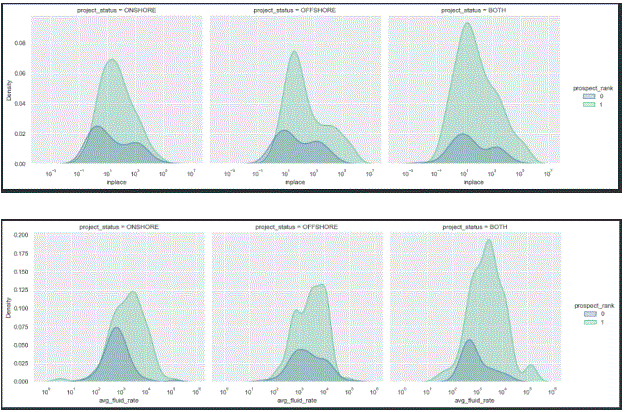

On two plots above we spot many insights that explain how both `inplace` and `avg_fluid_rate` could be a valuable predictor:
- First, we notice that when we have bigger `inplace` it improve our chance to have better `prospect_rank` whenever our field is located on offshore/ onshore/ both for all fluid type.
- Second, `avg_fluid_rate` plays significant role since it can reveal very insightful notions that by having higher rate we are inclined to have better economic value for all project location and fluid type.
- Third, `avg_fluid_rate` >= 1000 BOPD.E could be considered as fundamental rate cut off, whenever we pass this value we are inclined to have profitable field but some concern remains that on `project_status`==Offshore, probably, we need additional variable than single `avg_fluid_rate` in order to spot a better cut off as minimum hydrocarbon fluid rate.

So, when we have a new field, by ensuring this field to deliver significant high rate (above 1000 BOPD.E) might lead us to get a better chance having profitable oil/ gas field regardless their location and fluid type.

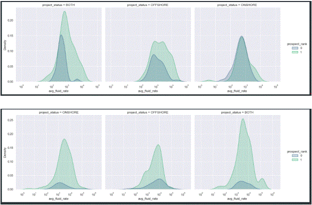

Looking forward on more detailed analysis after figuring out that `avg_fluid_rate` could be used as strong predictor explaining `prospect_rank` when rate is above 1000 BOPD.E, although showing minor effect on offshore location for Gas only fluid type (shown on 2 plots above), we intended to expand the analysis by breaking down offshore projects according to their `fluid`==Gas and their `region`, as shown on plot below:

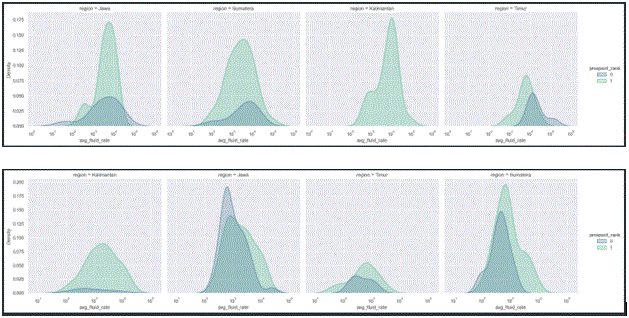

We obtained many meaningful informations by using 2 plots above:
- Kalimantan is the most preferable `region` to produce hidrocarbon on offshore, whenever the `avg_fluid_rate`, We might have profitable oil & gas field, especially when `avg_fluid_rate` > 1000 BOPD.E.
- `avg_fluid_rate` >= 1000 BOPD.E could be used as profitable economic cutoff for `fluid`==Oil & `fluid`==Oil&Gas and any kind of regions and locations (second plot above)
- Beside Kalimantan, all gas field projects on offshore have strong tendency to be less profitable when those fields could produce over 1000 BOPD.E. It might be an early indication that those regions have market/ infrastructure issues related to gas. These issues are important and deserve more troughout analysis on modeling.

__Effect of rate and operator on prospect_rank__

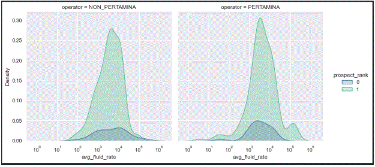

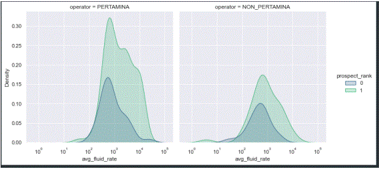

Those 2 plots above imply that:
- Since Pertamina has more diverse field than others it might improve Pertamina's portofolio
- When it comes to gas field, more projects have better profitability under Pertamina than others. This condition might exist probably because of project integration, market readiness, and sound infrastructure alignment inside Pertamina business unit
- On oil project, neither Pertamina nor Others could deliver better performance on profitabilty but we might use `avg_fluid_rate` > 1000 BOPD.E as economic cutoff.

__General Conclusion from EDA :__
1.	We suspect there is a causal effect of `inplace` & `avg_fluid_rate` in `prospect_rank`. While we segmented on `fluid` we notice that by having bigger `inplace` and `avg_fluid_rate` could lead us to more preferable economic of scale benefit
2.	When fields are having a deeper reservoir target they need either bigger `inplace` or `avg_fluid_rate` in order to become more economical.
3.	We suspect on `Gas` that either `region` or `location` could play major role to spot non market potential area/ region.
4.	When all others region shows consistent trend reflecting good and rational relationship between `depth`, `inplace`, `avg_fluid_rate` on `prospect_rank`, but `region`==Timur shows the opposite. This information/ our hypothesis from data relates to actual condition where market potential for gas on eastern indonesia (timur) is very limited, therefore a good relationship between `depth`, `inplace`, `avg_fluid_rate` on `prospect_rank are` not shown clearly.
5.	When we have a new field, by ensuring this field to deliver significant high rate (above 1000 BOPD.E) might lead us to get a better chance having profitable project regardless their location if fluid type is oil but it might not work for gas if it is located at offshore.
6.	Kalimantan is the most preferable `region` to produce hidrocarbon on offshore, whenever the `avg_fluid_rate`, We might have profitable project, especially when `avg_fluid_rate` > 1000 BOPD.E.
7.	`avg_fluid_rate` >= 1000 BOPD.E could be used as profitable economic cutoff for `fluid`==Oil & `fluid`==Oil&Gas on any kind of regions and location.
8.	Beside Kalimantan, all gas field projects on offshore have strong tendency to be less profitable when those fields could produce over 1000 BOPD.E. It might be an early indication that those regions have market/ infrastructure issues related to gas.
9.	Since Pertamina has more diverse field than others it might improve Pertamina's portofolio
10.	When it comes to gas project, more projects have better profitability under Pertamina than others. This condition might exist probably because of project integration, market readiness, and sound infrastructure alignment inside Pertamina business unit
11.	On oil project, neither Pertamina nor others could deliver better performance on profitabilty but we might use `avg_fluid_rate` > 1000 BOPD.E as economic cutoff.

## Modeling Process
----------------------------
__Data Transformation__

We are not going to apply any transformation on numerical data but for categorical we apply one_hot_encoding.

__Modeling__

In the modeling process we train several models i.e :
-	Logistic Regresion
-	Random Forest
-	Decision Tree
-	KNN Classifier
-	LGBM
-	XGBoost
-	SVC
-	Gaussian Naive Bayes

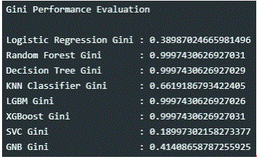

We chose the three (3) initial models that had the highest Gini score and as can be seen from the figure above where it was found that the best models were Decision Tree, LGBM, and XGBoost.

Based on baseline model analysis, after conducting random search (hyperparameter tuning)  we select 1 model from 3 selected models that are top performers for more advanced tuning using HyperOpt. That model is XGBoost.

__NOTE :__ We find there is no significant improvement by using DL and since we are convinced that for multi features/ tabular data when all those features are heterogeneous (not homogenous like pictures/ videos dataset) XGBoost might be the best possible option. Moreover, for simplification since time is our primary concern beside accuracy, keeping XGBoost as main model and doing some advanced optimization method (HyperOPT) to search an optimal configuration is considered as the best decision.

https://www.quora.com/Why-is-XGBoost-among-most-used-machine-learning-method-on-Kaggle

__Model Result on Test Data__

With xgboost as our model, we retrained the model with train and valid data and tested it on the test data. Our test results can be seen in the figure below.

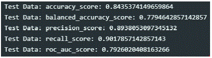

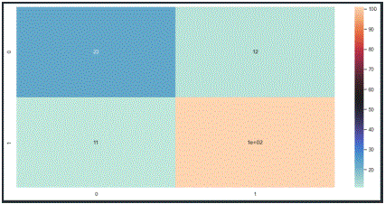

Stopping criteria in our Hyperopt tuning is based on its reability in term of acceptable roc_auc_score ~0.80, high recall_score ~0.90 which is suitable to identify prospective fields as many as possible to be developed, high precision_score ~0.89 obtained relative to recall_score, therefore, could help users to find real/ true prospective fields in timely manner with minimal re-evaluation job.

## Product
---------------------
From the model that we have created, we save it with the Joblib module in the form of pkl. Next we make a deployment using heroku. The results of our deployment can be seen on the link https://peaceful-ravine-66425.herokuapp.com/docs. The snapshot of the interface of our product is as shown in the image below:

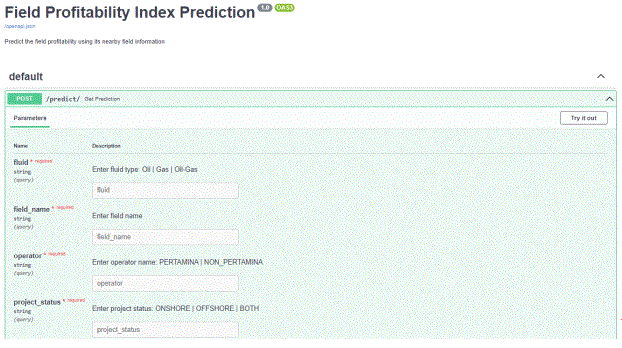

## Result
---------------------
When we have finished filling in all the data on the form we can click submit and the application will calculate the results whether our field is profitable (1) or marginal (0) as long as its probability.

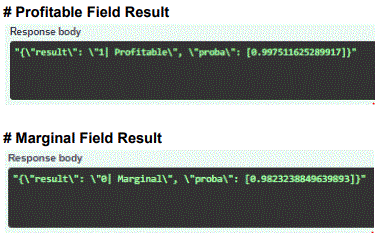

## Conclusion
-------------------
1.	XGBoost has been selected as model ready and has been deployed on Heroku
2.	Decision to select XGBoost is based on its reability in term of acceptable roc_auc_score ~0.80, high recall_score ~0.90 which is suitable to identify prospective fields as many as possible to be developed, high precision_score ~0.89 obtained relative to recall_score, therefore, could help users to find real/ true prospective fields in timely manner with minimal re-evaluation job, furthermore, on its capability to allow engineer doing iteration, finetuning and optimization as fast as possible
3.	Information from trees in XGBoost combined with features_importances could help engineer getting meaningful insight related to intrinsic factors that could effect field prospective index. Also, by using these trees, engineer could weight their focus on certain aspects to increase their odd finding the profitable oil & gas assets

## References
---------------
- eSDC Dataset

## App Link
---------------
https://peaceful-ravine-66425.herokuapp.com/docs. 
